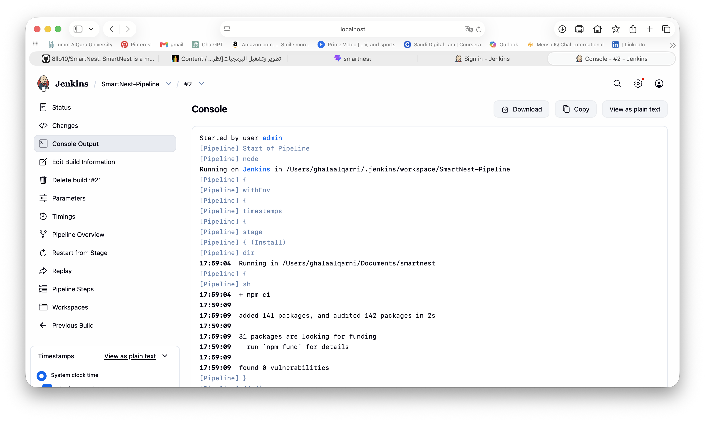
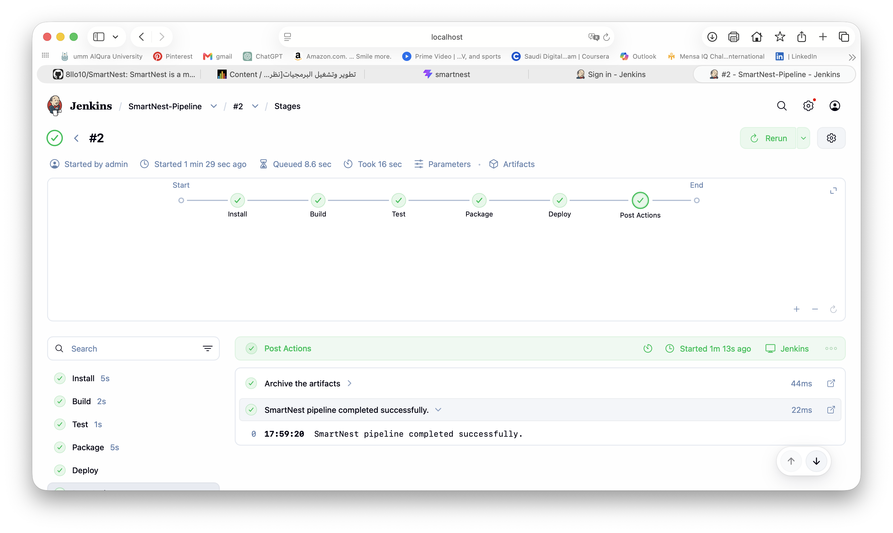
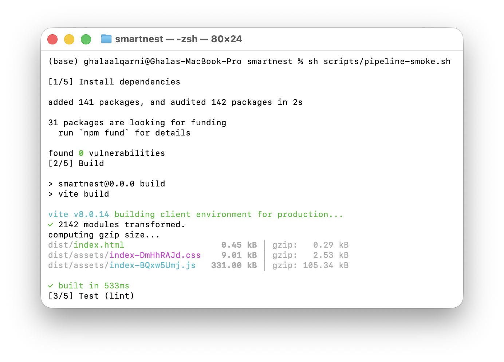
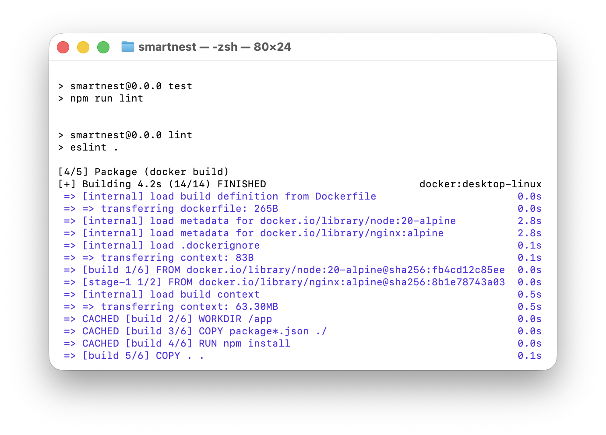
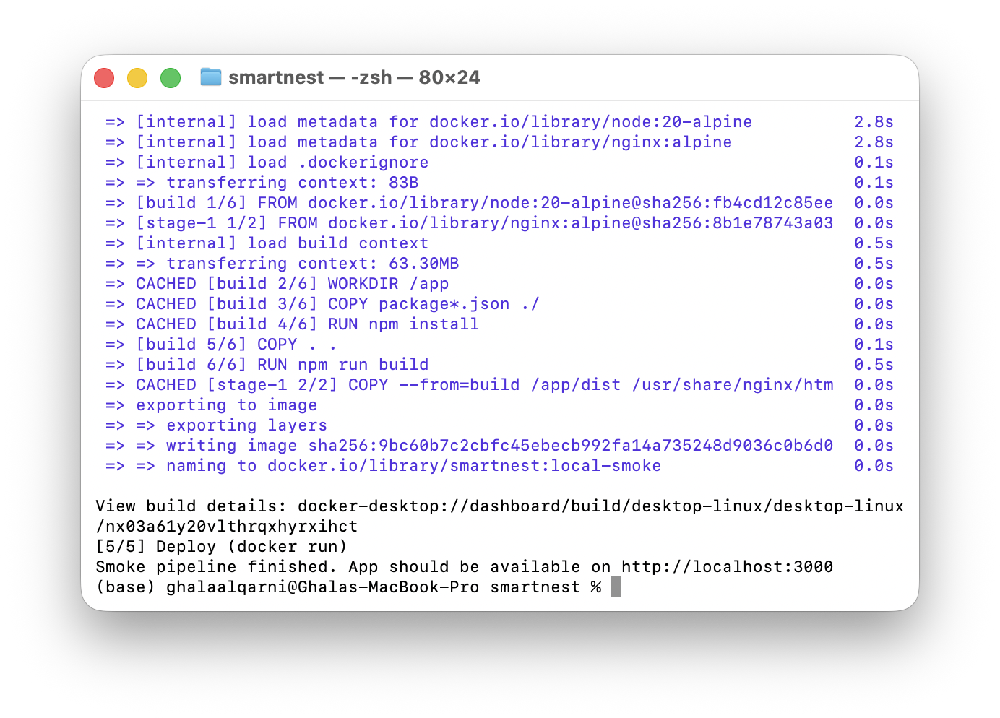
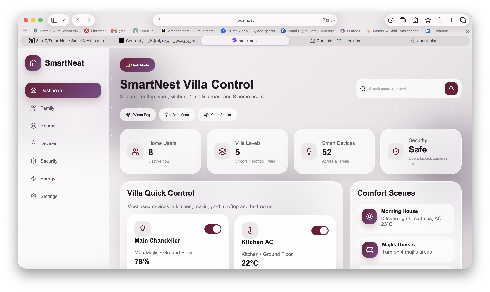

# SmartNest Jenkins CI/CD Demo Report

Date: June 3, 2026  
Project: SmartNest  
Demo Type: Local Jenkins Pipeline without GitHub  
Tools: Jenkins, Docker, Node.js, npm, React, Vite

## Requirement Coverage Table

| Demo Requirement | Status | Evidence |
| --- | --- | --- |
| Jenkins Pipeline is running | Yes | The `SmartNest-Pipeline` job completed successfully in Jenkins. |
| Install dependencies | Yes | The Install stage runs `npm ci`. |
| Build | Yes | The Build stage runs `npm run build` using Vite. |
| Test / Quality check | Yes | The Test stage runs `npm test`, which executes the ESLint quality gate. |
| Package | Yes | The Package stage builds a Docker image and saves it as a `.tar` artifact. |
| Deploy | Yes | The Deploy stage runs the Docker container locally on port `3000`. |
| Application running proof | Yes | The SmartNest dashboard is shown running at `http://localhost:3000`. |
| Live demo ready | Yes | Jenkins can rerun the pipeline step by step using the `SmartNest-Pipeline` job. |
| Source integration | Yes | The local Jenkins job reads the project from `/Users/ghalaalqarni/Documents/smartnest` for a local demo without GitHub. |
| Build trigger | Yes | A scheduled Jenkins trigger is defined using `cron('H H * * *')`; the demo can also be triggered manually with Build Now / Rerun. |
| Failure handling | Yes | The pipeline stops automatically on failed commands, and the `SIMULATE_TEST_FAILURE` parameter can demonstrate a failure in the Test stage. |
| Environment variables | Yes | The Jenkins pipeline defines `APP_NAME`, `IMAGE_NAME`, `CONTAINER_NAME`, `APP_PORT`, and `PATH`. |
| Post-build actions | Yes | The Post Actions stage archives `dist/**` and `*.tar`, then prints success or failure messages. |

Note: This demo is intentionally configured as a local Jenkins pipeline without GitHub. If remote SCM integration is required, the same `Jenkinsfile` can be connected to a GitHub repository later.

## 1. Jenkins Console Output - Install Stage

This screenshot shows Jenkins starting the `SmartNest-Pipeline` job and running the first stage. The pipeline reads the project from the local machine and runs `npm ci` to install dependencies.



## 2. Jenkins Pipeline Stages - Successful Run

This screenshot shows the main Jenkins pipeline view. All stages completed successfully: `Install`, `Build`, `Test`, `Package`, `Deploy`, and `Post Actions`.



## 3. Dockerfile - Container Image Configuration

The project uses a multi-stage Dockerfile. The first stage builds the React/Vite application using Node.js, and the second stage serves the production files using Nginx.

```dockerfile
FROM node:20-alpine AS build
WORKDIR /app
COPY package*.json ./
RUN npm install
COPY . .
RUN npm run build

FROM nginx:alpine
COPY --from=build /app/dist /usr/share/nginx/html
EXPOSE 80
CMD ["nginx", "-g", "daemon off;"]
```

## 4. Local Smoke Test - Install, Build, and Test

This screenshot shows the local smoke test script running the first steps outside Jenkins. It installs dependencies, builds the Vite production bundle, and starts the lint test step.



## 5. Docker Image Build - Package Stage

This screenshot shows Docker building the SmartNest image. The package stage uses the project `Dockerfile` to create a deployable container image.



## 6. Docker Container Deployment

This screenshot shows Docker running the SmartNest container. The container maps port `80` inside Nginx to local port `3000`, making the app available in the browser.



## 7. Deployed SmartNest Application

This screenshot shows the final deployed SmartNest dashboard running in the browser on `localhost:3000`.



## Pipeline Summary

The Jenkins pipeline completed successfully and demonstrated a local CI/CD workflow:

1. Install project dependencies using `npm ci`.
2. Build the production application using `npm run build`.
3. Run the quality check using `npm test`.
4. Package the application as a Docker image.
5. Deploy the Docker container locally on port `3000`.

## Result

The demo was successful. Jenkins automated the CI/CD workflow, Docker packaged and deployed the app, and SmartNest was available at:

```text
http://localhost:3000
```

Final Jenkins result:

```text
SmartNest pipeline completed successfully.
Finished: SUCCESS
```
